#  Solving 1D and 2D Heat Diffusion Equations Using Physics-Informed Neural Networks

## 1. Background

In 1990s, [Lagaris et al](https://arxiv.org/abs/physics/9705023). use the neural network to solve Partial Differential Equation (PDE) and Ordinary Differential Equation (ODE). They designed an artificial neural network structure in which the input is spatio-temporal coordinates (x,y,z,t) and the output is a physical variable. However, due to limited computing power, this method still cannot compete with another numerical method such as the Finite Element Analysis (FEA).

Between 2000 and the 2010s, the world of computing was transformed by deep learning. Powered by vast amounts of data, this technique enables AI to recognize faces, translate languages, and categorize images. However, When engineers attempt to apply deep learning to science and engineering, they encounter major obstacles such as a scarcity of physical experimental data, physics-blind models, and the "black box" effect. This phase made them realize that AI cannot learn on its own using only data.

To address the issue of AI's lack of physical awareness, PINNs were introduced in 2017 via the paper by [Raissi et al. (2019)](https://www.sciencedirect.com/science/article/abs/pii/S0021999118307125), utilizing a loss function that incorporates physical equations through automatic differentiation.

PINN is a machine learning model that incorporates physical laws—expressed as differential equations—into the loss function to obtain a solution consistent with the underlying physics. This model can be used to:

- Approximate solutions for partial differential equations and ordinary differential equations.

- Solving inverse problems—tracing observed results back to determine the underlying causes or hidden physics that produced them—is akin to estimating model parameters using limited data.

  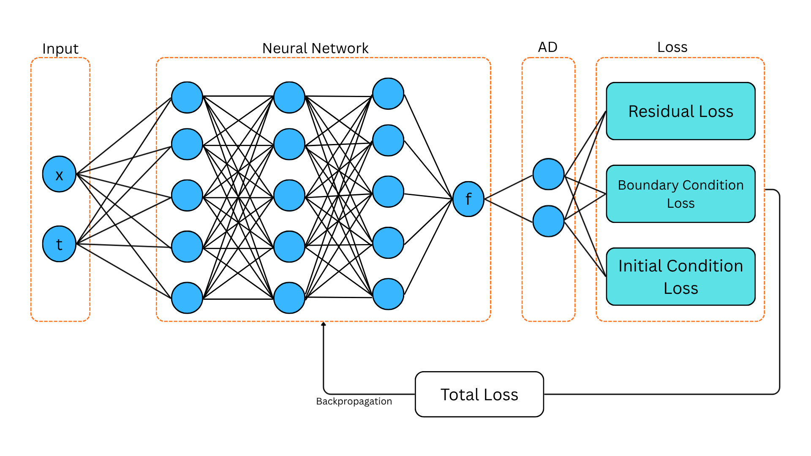
  
<em>Figure 1: PINN Structure</em>

The Figure 1 illustrates the PINN structure that consist input, neural network, Automatic Differentiation (AD), and loss function. The AD used to calculate partial differentiation of the neural network output. Figure 1 shows two nodes: one containing an identity matrix, and the other representing first- and second-order partial derivatives. After calculating the total loss, the model is then optimized to produce the lowest possible loss score. The working principle of the PINN method involves substituting the differential equation into the loss function and employing optimization to update the neural network parameters $\Theta = \{(a_j,b_j)\}_{j=1}^M$ such that the function value approaches zero. The value of the loss function can be determined using the equation

$$L_{total} =\lambda_{res} L_{res} (\Theta) + \lambda_{conds} L_{conds}(\Theta).$$

where $L_{res}$ and $L_{conds}$ are PDE residual and conditions (initial and boundary), respectively, while $\lambda_{res}$ and $\lambda_{conds}$ are weighting coefficient. Consider the neural network

$$z_{i+1}^k = \sigma(a_i z_i^k + b_i), \quad i \in \{1,2,...,N \}, \quad z_0^k = d^k$$

where $\sigma$ represent activation function TanH and $\Theta$ is the neural network parameters. The output of $z_{\Theta} [d^k]$ (or $z_{\Theta}^k$) is 

$$z_{\Theta}^k \approx f(x_k,t_k) \quad \text{for every } k \in 1,....,M$$

and in two dimensional version

$$z_{\Theta}^k \approx f(x_k,y_k,t_k) \quad \text{for every } k \in 1,....,M$$

## Heat Diffusion Equation 
Consider heat propagating in a 1-dimensional rod from 0 to L during time t. The measured temperature is $\hat{f}$. The heat propagation that occurs can be described by the equation

$$\partial_{t}f - \alpha \nabla^2 {f} = f_{src}.$$

where $\alpha$, $\nabla$ and $t$ are thermal diffusivity constant, space, and time variables, respectively. The term $f_{src}$ is referred to as the source term; it represents the presence of an external factor within the material that generates or absorbs heat over time. The PINN simulation involves initial and boundary conditions.

### One Dimension

The boundary condition for one dimensional heat equation is

$$f(0,t) = f(L,t) = 0$$

where $ t > 0$ with the initial condition  

$$f(x,0) = f_0(x), \space \text{for} \space  0 < x < L.$$

The exact analytical solution obtained from the one-dimensional heat equation after applying the initial and boundary conditions, and assuming no source term ($f_{src} = 0$), is 

$$f(x,t) = e^{-t}sin(\pi x).$$

Meanwhile, the fabricated solution for one dimensional is

$$f(x,t) = x^2 (x - L)^2 (t-\frac12)^2$$

where $L$ is the maximum value of spatial domain. Visualizations of both solutions can be seen in the figure below

  

    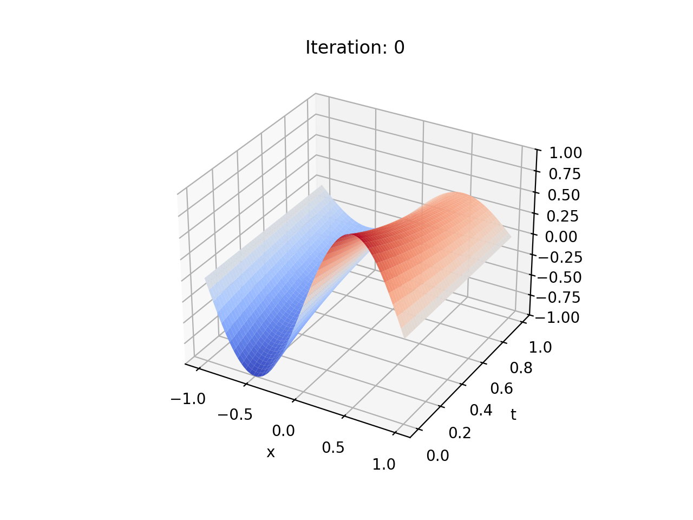
    
<em>Figure 2a: Analytic Solution Plot </em>

  

  

    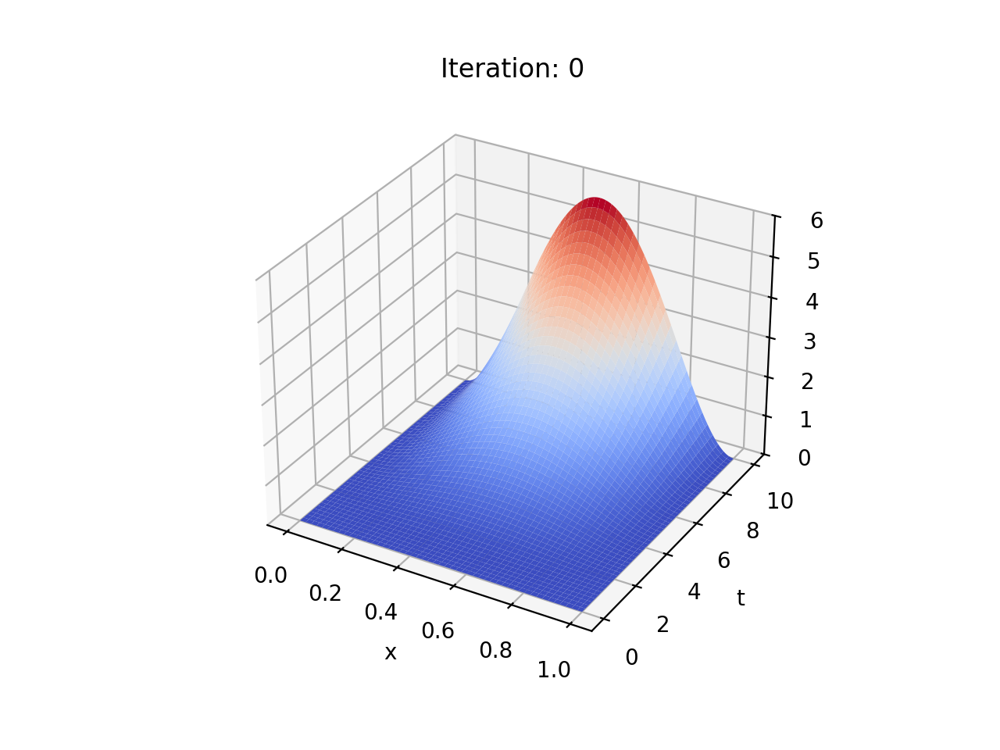
    
<em>Figure 2b: Fabricated Solution Plot</em>

  

### Two Dimension

The boundary condition for two dimensional version is

$$f(0,y,t) = f(L,y,t) = f(x,0,t) = f(x, L, t) = 0$$

where the initial condition 

$$f(x,y,0) = f_0(x,y), \quad \text{for} \quad  0 < x < L, \space 0 < y < L.$$

The exact analytical solution to the two-dimensional heat equation, after applying the initial conditions, boundary conditions, and setting $f_{term} = 0$, is

$$f(x, y,t) = e^{-t}sin(\pi x)sin(\pi y).$$

Meanwhile, the fabricated solution for the two-dimensional case is

$$f(x,y,t) = (xy)^2 (x - L)^2 (y - L)^2 (t-\frac12)^2.$$

where $L$ is the maximum value of spatial domain. Visualizations of both solutions can be seen in the figure below

  

    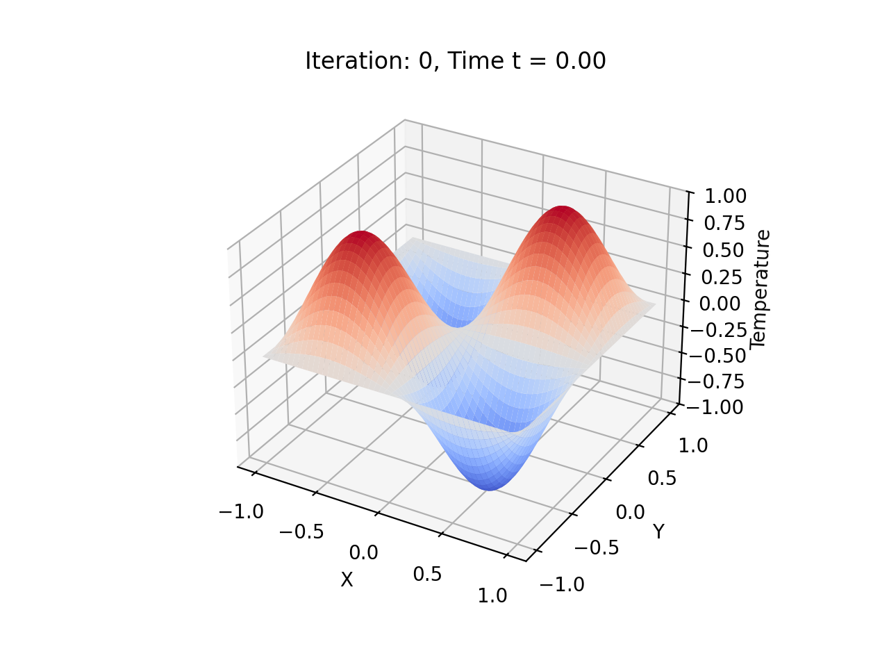
    
<em>Figure 3a: Analytic Solution Plot </em>

  

  

    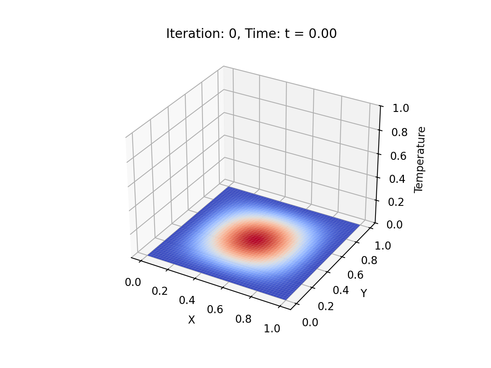
    
<em>Figure 3b: Fabricated Solution Plot</em>

  

To determine whether the PINN simulation is successful, the simulation results are compared with the function serving as the ground truth. This project employs two versions of ground truth: the real analytic solution derived directly from the heat equation, and a fabricated function—a function constructed based on predetermined boundary conditions.

## 2. Loss Function Formulation (Multi Objective Loss Function)

### 2.1 Loss Initial & Boundary Conditions

The condition, initial and boundary, contributes to the Neural Network via Loss function. The functions are

$$L_{conds} = L_{ic}(\Theta) + L_{bc}(\Theta) =  \sum_{d^k \in D_0} |z_{\Theta}[d^k]|^2 + \frac{1}{M_{bc}} \sum_{d^k \in D_{bc}}^M |z_{\Theta}[d^k]|^2$$

### 2.2 Residual Loss

The Loss term of Physics Informed $L_{res}$ computes the differential equation's residual across domain points via automatic differentiations (AD) or alternative numerical differentiation methods. This loss function has different forms depending on the form of the partial differential equation and the physics problem to be solved. The form of this function is

$$L_{res} (\Theta) = \frac{1}{M_{res}} \sum_{d^k \in D_{res}}^M |[\partial_{t}z_{\Theta} - \alpha \nabla^2 z_{\Theta}][d^k] - f_{src}|^2.$$

## 3. Neural Architecture & Computational Method

The PINN project uses an architecture for one dimensional heat equation 

$$FNN: [2,50 \space \times 4, 1].$$

whereas the two dimensional version

$$FNN: [3,50 \space \times 4, 1].$$

The activation function selected for this project is the Hyperbolic Tangent ($Tanh$), expressed by the equation

$$\sigma(j) = \frac{e^j - e^{-j}}{e^j + e^{-j}}.$$

To update the $\Theta $ parameters, the Adam (Adaptive Moment Estimation) optimization algorithm was used with learning rate is $10^{-4}$ for both case one and two. Additionaly, we preset 300 test data and 150 train data for both $x$ and $t$ points for one dimension, whereas . Training was executed with a batch size of 100 and a total of 5000 iterations per batch. The hidden part of the neural network architecture contains 4 layers of 50 neurones. At each iteration, the system recorded the solution parameters along with the resulting relative error and total loss function.

## 4. Experiment Result

### One Dimension

This project involves two cases.

* The first case utilize the domain $(x,t) \in (-1,1) \times (0,1)$ and the source term $f_{src}$ is

$$f_{src}(x,t) = e^{-t}(sin(\pi x) - \pi^2 sin(\pi x))$$

* The second case utilize the domain $(x,t) \in (0,1) \times (0,10)$ and source term $f_{src}$ is

$$f_{src}(x,t) = 2(t-0.5)x^2(x- 1)^2 - 2\alpha (6x^2 - 6x + 1) (t-0.5)^2$$

The results of the PINN simulation on the one dimensional heat equation can be seen in the image below

  

    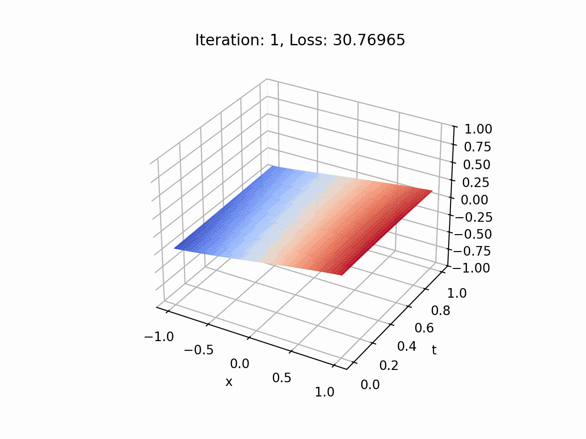
    
<em>Figure 4a: PINN first case </em>

  

  

    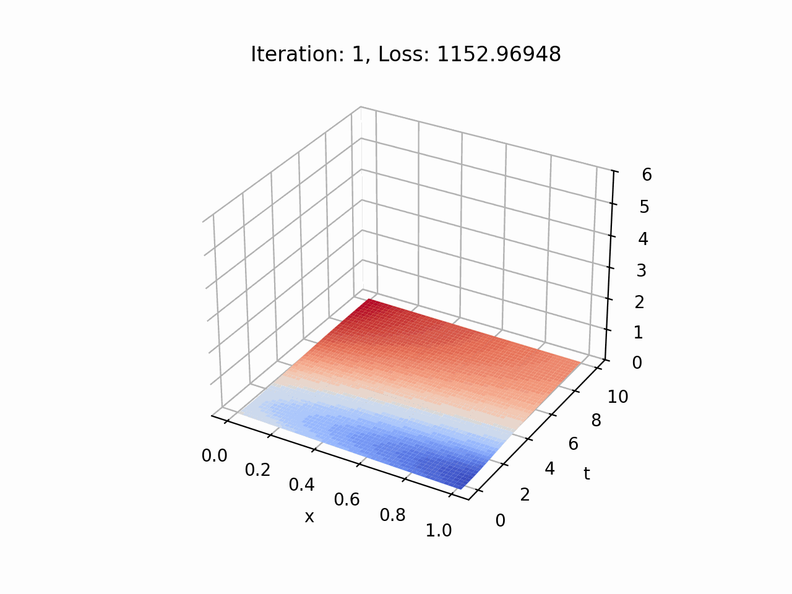
    
<em>Figure 4b: PINN second case</em>

  

* The two figures above show the temperature distribution in spatio-temporal plane.  Visually, the PINN simulation results for the first case in Figure 4a yield a final loss score of 0.0127 after 5000 iterations, closely resembling the ground truth function in Figure 2a. Similarly, the second case in Figure 4b produces a profile resembling the fabricated function in Figure 2b, achieving a loss score of 2.997 after the same number of iterations to the first one.

  

    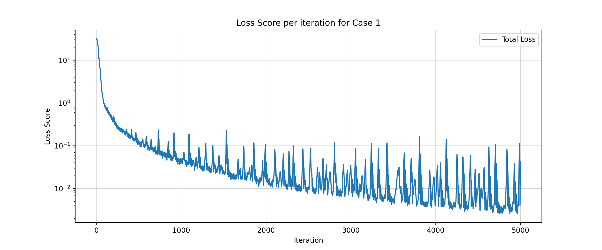
    
<em>Figure 5a: Loss Curve Case 1 </em>

  

  

    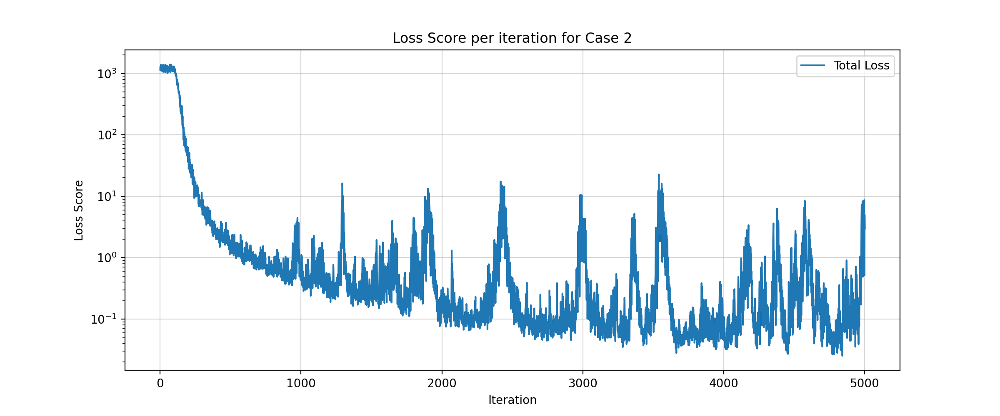
    
<em>Figure 5b: Loss Curve Case 2</em>

  

* The loss trajectory presented in **Figure 5a** exhibits a smooth monotonic decay during the first 500 iterations, decreasing from approximately $30$ to $0.13$. However, beyond this training threshold, the curve suffers from severe numerical instabilities, as evidenced by the emergence of periodic loss spikes. These spikes fluctuate with an amplitude of $10^{-1}$, deviating by roughly one order of magnitude from the underlying convergence baseline (loss envelope) situated at $10^{-2}$. These abrupt explosions persist throughout the optimization process up to 5000 iterations, ultimately yielding a final loss score of 0.0127, while failing to recover the global minimum of exact 0.0031 that was achieved at iteration 4900.

* In the second case shown in the **Figure 5b**, the total loss undergoes a rapid initial convergence during the early training phase, dropping significantly from just above $1000$ to approximately $5$ within the first 300 iterations. Nevertheless, upon entering the later stages, the optimization path encounters similar loss spikes as observed in the first case. The optimization concludes after 5000 iterations with a suboptimal final loss of 2.997, leaving the model unable to return to its global minimum of 0.0353 recorded at iteration 4800.

* The evaluation of both trajectories confirms that the model exhibits poor convergence, as evidence by the final loss score at the end of 5000 iterations remaining remaining higher than the global minimum archieved at a certain prior iteration. Futhermore, the Adam optimization process introduce severe numerical instability, which are visually manifested as periodic loss spikes. The onset of these spikes after specific iteration treshold occurs because the maximum eigenvalue of the Hessian matrix ($\lambda_{max}$) dynamically escalates and violates the classical stablity bound, inherently described by the Edge of Stability framework (Rathore et al, 2024). This phenomenon is mathematically driven by the delayed adjustment's of Adam's second-moment accumulator (adaptive preconditioner) as the model transitions from a smooth trajectory into a stiff physical domain (Wang et al, 2021). Consequently, the parameter updates overshoot the narrow valley of minimum value, projecting the weight, onto areas of high local curvature and resulting abrupt explosions (Bai et al, 2025).

### Two Dimension

This project involves two cases.

* The PINN simulation for the **first case** uses the domain $(x, y, t) \in (-1,1) \times (-1,1) \times (0,1)$ with the source term $f_{src}$

$$f_{src}(x,y,t) = (1 - \pi^2)e^{-t}sin(\pi x)sin(\pi y)$$

* The PINN simulation for the **second case** uses the domain $(x, y, t) \in (0,1) \times (0,1) \times (0,10)$ with the source term $f_{src}$  

$$
\begin{aligned}
f_{src} = & 2(t - 0.5) x^2 y^2 (x-1)^2 (y-1)^2 \\
& - 2\alpha (t - 0.5)^2 \Big[ y^2(y-1)^2(6x^2 - 6x + 1) + x^2(x-1)^2(6y^2 - 6y + 1) \Big]
\end{aligned}
$$

The results of the PINN simulation can be seen in the visualization below.

  

    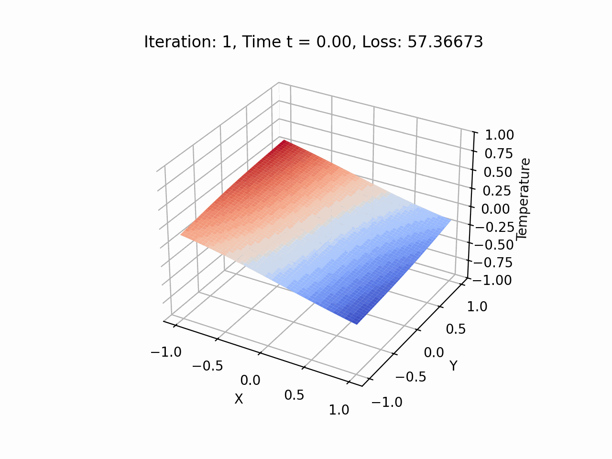
    
<em>Figure 6a: PINN first case </em>

  

  

    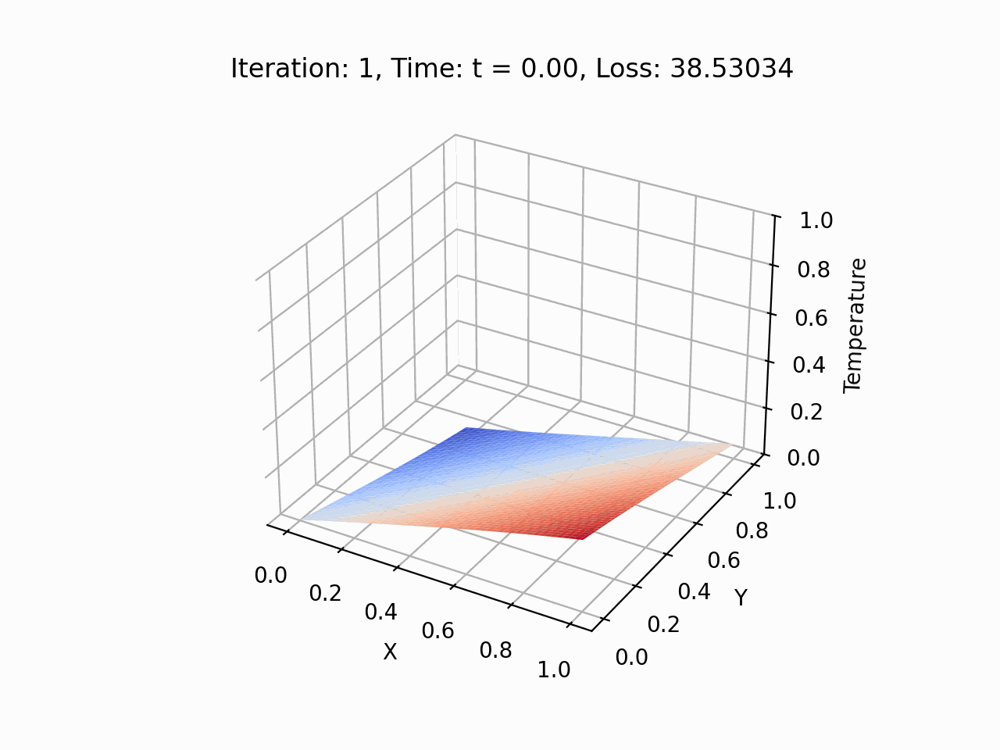
    
<em>Figure 6b: PINN second case</em>

  

* The **Figure 6a** shows the first PINN simulation case, displaying the temperature distribution in the $x-y$ plane at the initial condition t = 0, and the result is quite similar to the ground truth shown in Figure 3a. The final simulation result obtained after 5000 iterations shows a loss score of 2.7. In the second case shown in the **Figure 6b**, using the same architecture and number of iterations, the resulting graph deviates from the ground truth function shown in Figure 3b.
 

The loss curve after ​​throughout 5000 iterations of optimization on each case can be seen below.

  

    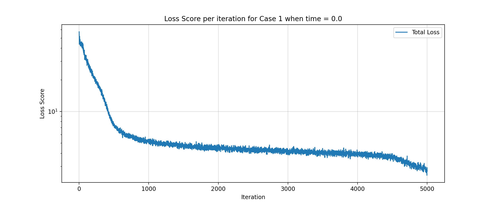
    
<em>Figure 7a: Loss Score first case </em>

  

  

    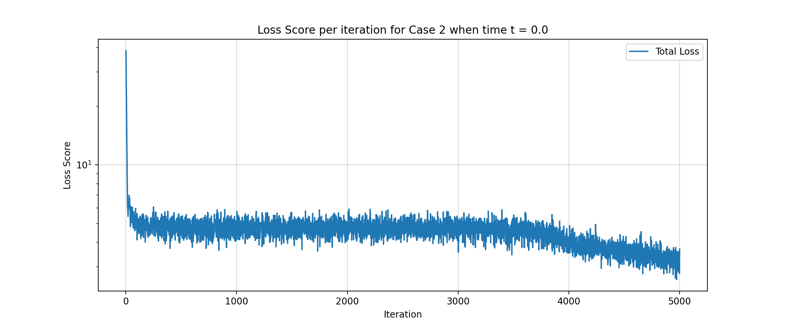
    
<em>Figure 7b: Loss Score second case</em>

  

* The optimization trajectory for the first case, presented in **Figure 7a**, demonstrates a strong convergence trend. During the initial 500 iterations, the total loss score exhibits a sharp decay, dropping significantly from approximately 57 to 7.4. Beyond this threshold, the curve enters a prolonged plateau phase, stagnating at approximately 4.5 between iterations 600 and 4600. In the final stage of training, the optimizer successfully drives the loss score down further, concluding after 5000 iterations at a minimum score of precisely 2.7.  

* The **Figure 7b** shows the score plummetted from approximately 35 to 5 on the first 100 iterations, then the curve enters plateau phase, stagnating by around 5 between 100 and around 3700 iterations. Then, the curve slightly dropped by 1.5 points of loss after the rest of iterations.

* Based on the optimization trajectories presented in Figures 6a and 6b, both models successfully achieve convergence, demonstrates by a significant minimization of the total loss function within the predetermined number of iteraiton. However, based on the Figure 6a, the optimization recording confirms that the minimum loss score of 2.7 is achieved precisely at the final 5000th iteration. Visually, the curve exhibits a sharp downward trajectory in its final stage without exhibiting a flat plateau or asymptotic behavior. This indicates that while the current score represents the global minimum achieved within the specified training budget, the model is still actively converging. Extending the maximum iteration threshold or transitioning to a second-order optimizer like L-BFGS could potentially allow the network to minimize the physical residual errors even further.

## 5. Conclusion

This project demonstrates the application of the Physics-Informed Neural Network method to solve the Fourier law-based heat diffusion equation in one and two dimensions. It employs nearly identical architectures for both the one-dimensional and two-dimensional versions. Each version involves two cases: the first uses an analytical solution as the ground truth, while the second uses a fabricated solution. The simulation results consist of temperature graphs for each room—derived from the PINN—along with the loss curve based on a predetermined number of iterations.

## Reference

* M. Raissi, P. Perdikaris, G.E. Karniadakis, Physics-informed neural networks: A deep learning framework for solving forward and inverse problems involving nonlinear partial differential equations, Journal of Computational Physics, Volume 378, 2019, Pages 686-707, ISSN 0021-9991,https://doi.org/10.1016/j.jcp.2018.10.045.
 
* Mary L. Boas, Mathematical Methods in the Physical Sciences, John Wiley & Sons, Third Edition, 2006, Pages xviii + 839, ISBN 978-0-471-19826-0,https://www.wiley.com/en-kr/Mathematical+Methods+in+the+Physical+Sciences%2C+3rd+Edition-p-9780471198260

* I. E. Lagaris, A. Likas, and D. I. Fotiadis, "Artificial neural networks for solving ordinary and partial differential equations," in IEEE Transactions on Neural Networks, vol. 9, no. 5, pp. 987-1000, Sept. 1998, doi: 10.1109/72.712178.

* S. Wang, Y. Teng, and P. Perdikaris, "Understanding and mitigating gradient flow pathologies in physics-informed neural networks," in SIAM Journal on Scientific Computing, vol. 43, no. 5, pp. A3055-A3081, Sept. 2021, doi: 10.1137/20M1318043.

* A. Rathore, N. S. H. K. Rathore, C. Heitsch, and M. A. Grover, "Challenges in training PINNs: A loss landscape perspective," arXiv preprint arXiv:2402.01868, Feb. 2024, doi: 10.48550/arXiv.2402.01868.

* Y. Bai, J. Zhao, M. Jordan, and S. S. Du, "Adaptive preconditioners trigger loss spikes in Adam," arXiv preprint arXiv:2506.04805, June 2025, doi: 10.48550/arXiv.2506.04805.

## Credits and Acknowledgments

This project utilizes and modifies parts of the code developed by:
* **FAU Chair for Dynamics, Control, Machine Learning and Numerics - Alexander von Humboldt Professorship** (Copyright (c) 2025).
* Original license: [MIT License](LICENSE).

We highly appreciate their open-source contribution which served as the foundation for this simulation.